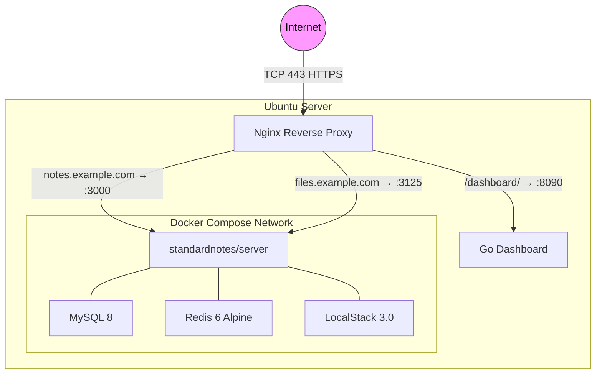

<![CDATA[<div align="center">

```
╔═══════════════════════════════════════════════════════╗
║                                                       ║
║   ███████╗████████╗██████╗    ███╗   ██╗ ██████╗      ║
║   ██╔════╝╚══██╔══╝██╔══██╗   ████╗  ██║██╔═══██╗     ║
║   ███████╗   ██║   ██║  ██║   ██╔██╗ ██║██║   ██║     ║
║   ╚════██║   ██║   ██║  ██║   ██║╚██╗██║██║   ██║     ║
║   ███████║   ██║   ██████╔╝██╗██║ ╚████║╚██████╔╝     ║
║   ╚══════╝   ╚═╝   ╚═════╝ ╚═╝╚═╝  ╚═══╝ ╚═════╝    ║
║                                                       ║
║          S E L F - H O S T E D   S E R V E R          ║
║                                                       ║
╚═══════════════════════════════════════════════════════╝
```

**Production-ready, one-server Standard Notes self-hosting for Ubuntu.**

[](https://ubuntu.com/)
[](https://docs.docker.com/compose/)
[](https://nginx.org/)
[](LICENSE)
[](https://standardnotes.com/)

</div>

---

## ✨ Highlights

| Feature | Description |
|:--------|:------------|
| 🐳 **Official Docker Flow** | Uses the Standard Notes `server`, `localstack`, `db`, and `cache` topology |
| 🔒 **Hardened by Default** | HTTPS, HSTS, Fail2ban, UFW, secrets with `openssl rand`, services on `127.0.0.1` only |
| 📦 **Automated Backups** | Systemd timer with MySQL dumps, uploads, Redis snapshots, config — all SHA-256 verified |
| 🩺 **Health Dashboard** | Go-based status dashboard behind dual Basic Auth, accessible at `/dashboard/` |
| 🛠️ **`snctl` CLI** | Manage status, logs, backups, updates, registration, and PRO grants from one command |
| 🔄 **Safe Reruns** | Installer preserves existing secrets, backs up `.env`, and supports incremental reconfiguration |
| 🎓 **Guided First Account** | Automated wizard: open registration → wait for signup → grant PRO → lock registration |
| 🛡️ **Unattended Updates** | Optional automatic Ubuntu security patching via `unattended-upgrades` |

---

## 🏗️ Architecture



> **Note**
> Publicly open ports: **80/tcp** (Let's Encrypt + redirect), **443/tcp** (HTTPS), and **your SSH port**.
> Do **not** expose `3000`, `3125`, `8090`, MySQL, Redis, or LocalStack publicly.

---

## 🚀 Quick Start

```bash
# 1 · Upload or clone the repo on your Ubuntu server
git clone https://github.com/cempack/standard-notes-project.git

# 2 · Run the installer
cd standard-notes-project
chmod +x install.sh
sudo ./install.sh

# 3 · Follow the interactive prompts (domains, certs, dashboard, etc.)

# 4 · Create your first account using the guided wizard
snctl first-account you@example.com
```

> **Tip**
> The installer is safe to rerun. It preserves existing Standard Notes secrets from `.env`, backs up the current `.env` before rewriting managed values, and keeps the dashboard password if you leave it blank without changing the username.

---

## 📑 Table of Contents

- [Requirements](#-requirements)
- [Installation](#-installation)
- [What the Installer Does](#-what-the-installer-does)
- [Management CLI — snctl](#-management-cli--snctl)
- [Client Setup](#-client-setup)
- [Dashboard](#-dashboard)
- [Health Checks & Tests](#-health-checks--tests)
- [Backups & Restore](#-backups--restore)
- [Updates](#-updates)
- [Security](#-security)
- [Troubleshooting](#-troubleshooting)
- [Configuration Reference](#-configuration-reference)
- [Logs](#-logs)
- [Roadmap](#-roadmap)

---

## 📋 Requirements

| Requirement | Details |
|:------------|:--------|
| **OS** | Fresh Ubuntu 22.04 LTS or 24.04 LTS |
| **Access** | Root or `sudo` |
| **DNS** | `notes.example.com` → server IP, `files.example.com` → server IP |
| **Firewall** | Cloud security group allows `80/tcp`, `443/tcp`, and your SSH port |
| **RAM** | ≥ 2 GB recommended by Standard Notes for the Docker setup |

---

## 📥 Installation

Upload or unzip this repository on the server, then run:

```bash
cd standard-notes-project
chmod +x install.sh
sudo ./install.sh
```

The interactive installer asks for:

| Prompt | Example / Default |
|:-------|:------------------|
| Install directory | `/opt/standardnotes` |
| Notes/API domain | `notes.example.com` |
| Files domain | `files.example.com` |
| Let's Encrypt email | `admin@example.com` |
| Dashboard username & password | *(your choice)* |
| SSH port to keep open in UFW | `22` |
| Use Let's Encrypt or self-signed certs? | Let's Encrypt |
| Enable unattended Ubuntu security updates? | Yes/No |
| Enable UFW firewall rules? | Yes/No |
| Disable new user registration immediately? | No *(until first account exists)* |
| Install `snctl` management CLI? | Yes |
| Run guided first-account flow? | Yes/No |
| Add sudo user to Docker group? | *(optional, root-equivalent)* |
| Backup retention & schedule | *(configurable)* |
| Run an initial backup? | Yes/No |

---

## 🔧 What the Installer Does

<details>
<summary><strong>Click to expand full details</strong></summary>

### Packages installed

- Docker Engine & Docker Compose plugin
- Nginx
- Certbot
- Fail2ban
- UFW
- `unattended-upgrades`
- Go compiler (for the dashboard)
- Backup / test dependencies

### Configuration generated

Copies the project to `/opt/standardnotes` (or your selected directory) and generates `.env` with:

| Variable | Source |
|:---------|:-------|
| `DB_PASSWORD` | `openssl rand` |
| `AUTH_JWT_SECRET` | `openssl rand` |
| `AUTH_SERVER_ENCRYPTION_SERVER_KEY` | `openssl rand` |
| `VALET_TOKEN_SECRET` | `openssl rand` |
| `AUTH_SERVER_DISABLE_USER_REGISTRATION` | `false` by default |
| `PUBLIC_FILES_SERVER_URL` | `https://files.example.com` |

### Docker services started

```bash
docker compose pull && docker compose up -d
```

### Nginx configured

| Route | Upstream |
|:------|:---------|
| `https://notes.example.com` | `127.0.0.1:3000` |
| `https://files.example.com` | `127.0.0.1:3125` |
| `https://notes.example.com/dashboard/` | `127.0.0.1:8090` |

### Additional setup

- Fail2ban jails for Nginx auth/bot/4xx abuse
- Automatic Ubuntu security updates (if selected)
- `standardnotes-backup.timer` systemd backup schedule
- Go dashboard built and run as locked-down `sn-dashboard` system user
- `snctl` installed to `/usr/local/bin/snctl` (when selected)

</details>

---

## 🛠️ Management CLI — `snctl`

When selected during installation, the installer creates:

```text
/usr/local/bin/snctl → /opt/standardnotes/scripts/snctl
```

### Command Reference

| Command | Description |
|:--------|:------------|
| `snctl status` | Show Docker Compose service status |
| `snctl health` | Run the full health checker |
| `snctl logs [service]` | Follow Docker logs (default: `server`) |
| `snctl backup` | Run a manual backup |
| `snctl restore ARCHIVE` | Restore from a backup archive |
| `snctl update` | Backup → pull → restart → health check |
| `snctl first-account EMAIL` | Guided: register → grant PRO → lock |
| `snctl grant-pro EMAIL [--wait]` | Grant server-side PRO_USER / PRO_PLAN |
| `snctl lock-registration` | Disable new user sign-ups |
| `snctl unlock-registration` | Re-enable sign-ups |
| `snctl registration-status` | Print current registration setting |
| `snctl dashboard` | Print the dashboard URL |

### First-Account Wizard

`snctl first-account EMAIL@ADDR` runs an automated flow that:

1. Opens registration
2. Prints the Sync Server URL
3. Waits up to 30 minutes for that email to register
4. Grants server-side `PRO_USER` / `PRO_PLAN`
5. Asks whether to lock registration afterward

---

## 📱 Client Setup

### Connecting Standard Notes

In the Standard Notes desktop or mobile app:

1. Open the **account menu**
2. Choose **Advanced options**
3. Under **Sync Server**, choose **Custom**
4. Enter your notes URL:
   ```text
   https://notes.example.com
   ```
5. **Register** your first account on that custom server
6. Create a note and confirm it syncs

### Activating PRO

After your account exists, run the guided CLI flow (if you didn't during install):

```bash
snctl first-account you@example.com
```

This grants server-side `PRO_PLAN` and asks whether to lock registration.

To lock registration manually:

```bash
snctl lock-registration
```

You can also rerun `sudo /opt/standardnotes/install.sh` and answer yes to disabling registration.

> **Important**
> This unlocks **server-side** premium features only. It does **not** unlock client-side premium features such as Super notes or Nested tags in official clients. For full client-side premium features, use a Standard Notes offline plan.

### File Uploads

File uploads are served through the files domain set in `.env`:

```text
PUBLIC_FILES_SERVER_URL=https://files.example.com
```

> **Note**
> The official hosted web app at `app.standardnotes.com` is not used with a custom sync server. Use the desktop/mobile apps or self-host the Standard Notes web app separately.

<details>
<summary><strong>Server-side PRO subscription — manual method</strong></summary>

You can also grant PRO via the helper script directly:

```bash
sudo /opt/standardnotes/scripts/grant-pro-subscription.sh --wait EMAIL@ADDR
```

Manual equivalent from the official docs:

```bash
docker compose exec db sh -c "MYSQL_PWD=\$MYSQL_ROOT_PASSWORD mysql \$MYSQL_DATABASE -e \
  'INSERT INTO user_roles (role_uuid , user_uuid) VALUES ((SELECT uuid FROM roles WHERE name=\"PRO_USER\" ORDER BY version DESC limit 1) ,(SELECT uuid FROM users WHERE email=\"EMAIL@ADDR\")) ON DUPLICATE KEY UPDATE role_uuid = VALUES(role_uuid);' \
"

docker compose exec db sh -c "MYSQL_PWD=\$MYSQL_ROOT_PASSWORD mysql \$MYSQL_DATABASE -e \
  'INSERT INTO user_subscriptions SET uuid=UUID(), plan_name=\"PRO_PLAN\", ends_at=8640000000000000, created_at=0, updated_at=0, user_uuid=(SELECT uuid FROM users WHERE email=\"EMAIL@ADDR\"), subscription_id=1, subscription_type=\"regular\";' \
"
```

</details>

---

## 📊 Dashboard

The dashboard is available at:

```text
https://notes.example.com/dashboard/
```

### Dual-Layer Authentication

| Layer | Mechanism | Config File |
|:------|:----------|:------------|
| **1. Nginx** | Basic Auth | `/etc/nginx/standardnotes-dashboard.htpasswd` |
| **2. App** | Salted SHA-256 Basic Auth | `/etc/standardnotes-dashboard.env` |

### What It Shows

- ✅ Local API status
- ✅ Local files server status
- ✅ Public HTTPS status for notes and files domains
- ✅ Latest backup metadata
- ✅ Recent Nginx and Standard Notes log snippets (when readable)

### Service Management

```bash
sudo systemctl status standardnotes-dashboard
sudo systemctl restart standardnotes-dashboard
sudo journalctl -u standardnotes-dashboard -n 100 --no-pager
```

---

## 🩺 Health Checks & Tests

```bash
# Run the built-in health checker
sudo /opt/standardnotes/scripts/healthcheck.sh

# Run the guided test script
sudo /opt/standardnotes/scripts/test.sh
```

<details>
<summary><strong>Manual checks</strong></summary>

```bash
# HTTPS endpoints
curl -I https://notes.example.com
curl -I https://files.example.com

# Internal endpoints
curl -sS -o /dev/null -w 'API HTTP %{http_code}\n' http://127.0.0.1:3000
curl -sS -o /dev/null -w 'Files HTTP %{http_code}\n' http://127.0.0.1:3125

# Docker status
cd /opt/standardnotes && docker compose ps
cd /opt/standardnotes && docker compose logs -f server
```

> **Note**
> A `404` or `401` from a root API URL can still mean the service is reachable; the important first signal is that the connection succeeds and does not return a `5xx` or timeout.

</details>

---

## 💾 Backups & Restore

### Automated Backups

Backups are managed by the systemd timer:

```bash
# Check the timer
systemctl list-timers standardnotes-backup.timer --no-pager

# Run a manual backup
sudo /opt/standardnotes/scripts/backup.sh
```

Backups are written to:

```text
/opt/standardnotes/backups/standardnotes-backup-YYYYmmddTHHMMSSZ.tar.gz
/opt/standardnotes/backups/standardnotes-backup-YYYYmmddTHHMMSSZ.tar.gz.sha256
/opt/standardnotes/backups/LATEST.json
```

**Each backup includes:**

| Component | Content |
|:----------|:--------|
| Database | MySQL dump |
| Files | Upload data |
| Cache | Redis data snapshot |
| Config | `.env`, `docker-compose.yml`, `localstack_bootstrap.sh`, `.install-config` (when present) |

> **Warning**
> Backups contain secrets. Store off-server copies securely and restrict access.

### Restore

Copy the backup archive and its `.sha256` sidecar to the server, then run:

```bash
sudo /opt/standardnotes/scripts/restore.sh /path/to/standardnotes-backup-YYYYmmddTHHMMSSZ.tar.gz
```

You must type `RESTORE` to confirm. The restore script:

1. Verifies the `.sha256` sidecar when present
2. Saves a pre-restore copy of current config to `/opt/standardnotes/pre-restore-*`
3. Stops the current Compose stack
4. Restores config, uploads, and Redis data
5. Starts MySQL / Redis / LocalStack
6. Moves the current `data/mysql` directory aside to `data/mysql.pre-restore-*` so the restored `.env` database password can initialize a clean MySQL data directory
7. Drops and recreates the Standard Notes database in the clean MySQL instance
8. Imports the SQL dump
9. Starts the full stack

After restore, verify with:

```bash
sudo /opt/standardnotes/scripts/healthcheck.sh
```

---

## 🔄 Updates

Use the update helper:

```bash
sudo /opt/standardnotes/scripts/update.sh
```

It runs a backup first, then pulls and restarts:

```bash
cd /opt/standardnotes
docker compose pull
docker compose up -d
```

<details>
<summary><strong>Manual update steps</strong></summary>

```bash
sudo /opt/standardnotes/scripts/backup.sh
cd /opt/standardnotes
docker compose pull
docker compose up -d
sudo /opt/standardnotes/scripts/healthcheck.sh
```

</details>

> **Tip**
> For major Standard Notes server changes, compare this repo's `.env.example`, `docker-compose.yml`, and `localstack_bootstrap.sh` with the upstream Standard Notes examples before updating.

---

## 🔒 Security

| Measure | Details |
|:--------|:--------|
| **Secret generation** | `openssl rand`, stored in `.env` with mode `0600` |
| **Docker group** | Not added unless you opt in — membership is root-equivalent |
| **Service binding** | Docker ports bound to `127.0.0.1` only |
| **Public entry point** | Nginx is the only public HTTP gateway |
| **Transport** | HTTPS redirects and HSTS enabled |
| **Dashboard** | Basic Auth protected, served only through HTTPS |
| **Intrusion protection** | Fail2ban protects SSH and Nginx auth/bot abuse |
| **Firewall** | UFW opens only SSH, 80, and 443 (when enabled) |
| **OS patching** | Ubuntu unattended security updates (when selected) |
| **Container restart** | `restart: unless-stopped` policy |
| **Backup files** | Mode `0600`, contain sensitive data — handle accordingly |

---

## ❓ Troubleshooting

<details>
<summary><strong>🔴 Docker Hub rate limit ("You have reached your unauthenticated pull rate limit")</strong></summary>

Docker Hub limits the number of image pulls for unauthenticated users. The installer now automatically retries with backoff and offers to run `docker login` interactively.

If you still hit the limit:

1. **Create a free Docker Hub account** at [hub.docker.com/signup](https://hub.docker.com/signup)
2. **Log in** on the server:

```bash
docker login
```

3. **Rerun the installer:**

```bash
sudo ./install.sh
```

> **Tip**
> Authenticated (free) accounts get **200 pulls per 6 hours** instead of 100. Paid accounts have higher limits.

</details>

<details>
<summary><strong>🔴 Certbot fails</strong></summary>

Check all of these:

- DNS A/AAAA records point to this server
- Cloud firewall allows `80/tcp` inbound
- UFW allows `80/tcp`
- No other service is using port 80
- `http://notes.example.com/.well-known/acme-challenge/test` reaches this server

Then rerun:

```bash
cd /opt/standardnotes
sudo ./install.sh
```

> **Tip**
> For testing without rate limits, choose Let's Encrypt **staging** certificates. Staging certificates are not trusted by clients.

</details>

<details>
<summary><strong>🔴 Nginx returns 502</strong></summary>

The Docker service behind Nginx is not reachable yet.

```bash
cd /opt/standardnotes
docker compose ps
docker compose logs --tail=200 server
curl -sS -o /dev/null -w '%{http_code}\n' http://127.0.0.1:3000
curl -sS -o /dev/null -w '%{http_code}\n' http://127.0.0.1:3125
```

> **Note**
> Wait a few minutes on first boot — MySQL initialization can take time.

</details>

<details>
<summary><strong>🔴 Docker Compose fails with DB password / MySQL auth error</strong></summary>

If this is a rerun on an existing install, do **not** regenerate `DB_PASSWORD`. The installer preserves it automatically.

If you manually changed it, restore the old value from `.env.bak.*` or rotate the MySQL password properly inside MySQL.

</details>

<details>
<summary><strong>🔴 Dashboard login loops</strong></summary>

The dashboard uses both Nginx Basic Auth and app Basic Auth with the same credentials. Rerun the installer and set a new dashboard password to resync both layers:

```bash
cd /opt/standardnotes
sudo ./install.sh
```

</details>

<details>
<summary><strong>🔴 Fail2ban banned my IP</strong></summary>

```bash
sudo fail2ban-client status
sudo fail2ban-client status standardnotes-nginx-dashboard-auth
sudo fail2ban-client unban YOUR_IP_ADDRESS
```

</details>

<details>
<summary><strong>🔴 Client cannot sync</strong></summary>

Check:

- The client Sync Server is exactly `https://notes.example.com` with **no** trailing path
- Your certificate is trusted — not self-signed or Let's Encrypt staging
- `curl -I https://notes.example.com` succeeds
- `docker compose ps` shows the server container running
- `PUBLIC_FILES_SERVER_URL=https://files.example.com` is present in `.env`

</details>

---

## ⚙️ Configuration Reference

<details>
<summary><strong>🔀 Changing domains later</strong></summary>

1. Update DNS for the new domains
2. Rerun the installer:
   ```bash
   cd /opt/standardnotes
   sudo ./install.sh
   ```
3. Enter the new notes/files domains
4. Let the installer update `.env`, Nginx, certificates, dashboard config, and health checks
5. Confirm `.env` contains the new files URL:
   ```bash
   grep '^PUBLIC_FILES_SERVER_URL=' /opt/standardnotes/.env
   ```

</details>

<details>
<summary><strong>🔑 Changing the dashboard password</strong></summary>

Rerun the installer and enter a new dashboard password when prompted:

```bash
cd /opt/standardnotes
sudo ./install.sh
```

Or manually update Nginx Basic Auth and the dashboard app hash. Rerunning the installer is safer because it keeps both layers in sync.

</details>

<details>
<summary><strong>🗝️ Changing Standard Notes secrets or database password</strong></summary>

> **Warning**
> Do **not** rotate `DB_PASSWORD` by editing `.env` alone on an existing database. MySQL users inside the existing data directory will still have the old password.

**Safer approaches:**

- **New empty install:** stop containers, remove `data/mysql`, update `.env`, and start again.
- **Existing install:** take a backup, update the MySQL user's password inside MySQL, update `.env`, then restart. Test thoroughly.

The installer intentionally preserves existing `.env` secrets on rerun.

</details>

<details>
<summary><strong>🔌 Changing host ports</strong></summary>

The project defaults are intentionally private:

```yaml
127.0.0.1:3000:3000
127.0.0.1:3125:3104
```

If you must change them:

1. Edit `/opt/standardnotes/docker-compose.yml` port bindings
2. Edit Nginx upstreams in `/etc/nginx/sites-available/standardnotes.conf` or update the template and rerun the installer
3. Restart:
   ```bash
   cd /opt/standardnotes
   docker compose up -d
   sudo nginx -t && sudo systemctl reload nginx
   ```

> **Caution**
> Keep the services bound to `127.0.0.1` unless you have a very specific reason not to.

</details>

---

## 📝 Logs

| What | Command |
|:-----|:--------|
| Standard Notes server | `docker compose logs -f server` |
| MySQL | `docker compose logs -f db` |
| LocalStack | `docker compose logs -f localstack` |
| Nginx errors (API) | `sudo tail -f /var/log/nginx/standardnotes-error.log` |
| Nginx errors (files) | `sudo tail -f /var/log/nginx/standardnotes-files-error.log` |
| Dashboard | `sudo journalctl -u standardnotes-dashboard -f` |
| Backups | `sudo journalctl -u standardnotes-backup -n 100 --no-pager` |

> **Note**
> Standard Notes container file logs are also mounted at `/opt/standardnotes/logs/`.
> All `docker compose` commands should be run from `/opt/standardnotes`.

---

## 🗺️ Roadmap

| Priority | Feature |
|:---------|:--------|
| 🟡 | Off-site encrypted backup sync (S3-compatible, restic, or borg) |
| 🟡 | Separate dashboard subdomain option |
| 🟢 | Monitoring integration (Prometheus / Grafana / uptime checks) |
| 🟢 | Self-hosting the Standard Notes web app as a separate service |
| 🟢 | More granular Fail2ban tuning after observing real traffic patterns |

---

<div align="center">

```
╔═══════════════════════════════════════════════════════╗
║          S E L F - H O S T E D   S E R V E R          ║
╚═══════════════════════════════════════════════════════╝
```

**Made with 🔒 security in mind**

[Report an Issue](https://github.com/cempack/standard-notes-project/issues) · [View on GitHub](https://github.com/cempack/standard-notes-project)

</div>

---

<details>
<summary><strong>📂 Repository Tree</strong></summary>

```text
standard-notes-project/
  install.sh
  README.md
  docker-compose.yml
  .env.example
  .gitignore
  localstack_bootstrap.sh
  backups/
    .gitkeep
  configs/
    logrotate/
      standardnotes
    unattended-upgrades/
      52standardnotes-unattended-upgrades
  dashboard/
    go.mod
    main.go
  fail2ban/
    filter.d/
      standardnotes-nginx-4xx.conf
      standardnotes-nginx-dashboard-auth.conf
    jail.d/
      standardnotes-nginx.local
  nginx/
    standardnotes-http.conf.template
    standardnotes-https.conf.template
  scripts/
    backup.sh
    grant-pro-subscription.sh
    healthcheck.sh
    restore.sh
    snctl
    test.sh
    update.sh
  systemd/
    standardnotes-backup.service.template
    standardnotes-backup.timer.template
    standardnotes-dashboard.service.template
```

</details>
]]>
